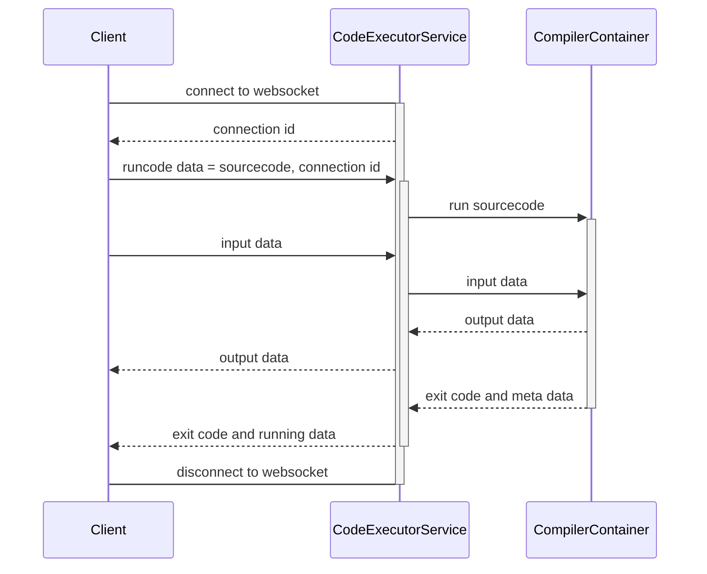

# CodeExecutorService

### How to run

Useing Docker Compose to run this project 

```shell
git clone https://github.com/UntitleCMS/CodeExecutorService.git
cd CodeExecutorService
docker compose up
```

Port `8080` is for `http` and `4433` is for `https`

### How to connect and run code frome client 

1. Useing [SignalR](https://learn.microsoft.com/en-us/aspnet/core/signalr/dotnet-client?view=aspnetcore-7.0&tabs=visual-studio) connect to `ip:4433/iodeliver` for input output transportation 
1. Send Code with `POST` method to `/Run` and add query sting `connectionID` for input output transmission from `1.` fro example `/Run?connectionID=[connectionID]`
1. Your input to program can pass by invoke `userinput` to server
1. Your will resive output on `processoutput`


### Sequence Diagram


