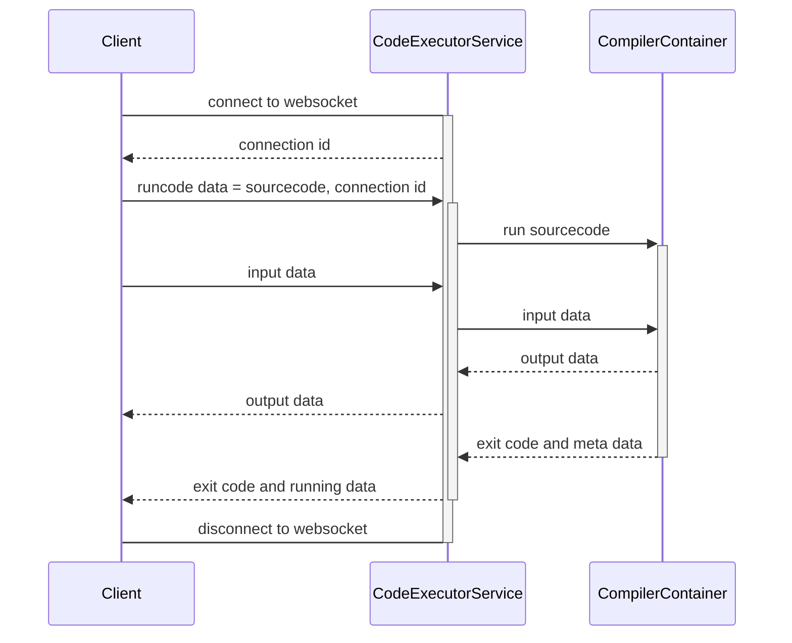

# CodeExecutorService

### Sequence Diagram

```mermaid
sequenceDiagram
    Client->+CodeExecutorService: connect to websocket
    CodeExecutorService-->>Client: connection id
    Client->>+CodeExecutorService: runcode data = sourcecode, connection id
    CodeExecutorService->>+CompilerContainer: run sourcecode
    Client->>CodeExecutorService: input data
    CodeExecutorService->>CompilerContainer: input data
    CompilerContainer-->>CodeExecutorService: output data
    CodeExecutorService-->>Client: output data
    CompilerContainer-->>-CodeExecutorService: exit code and meta data
    CodeExecutorService-->>-Client: exit code and running data
    CodeExecutorService->-Client: disconnect to websocket
```
